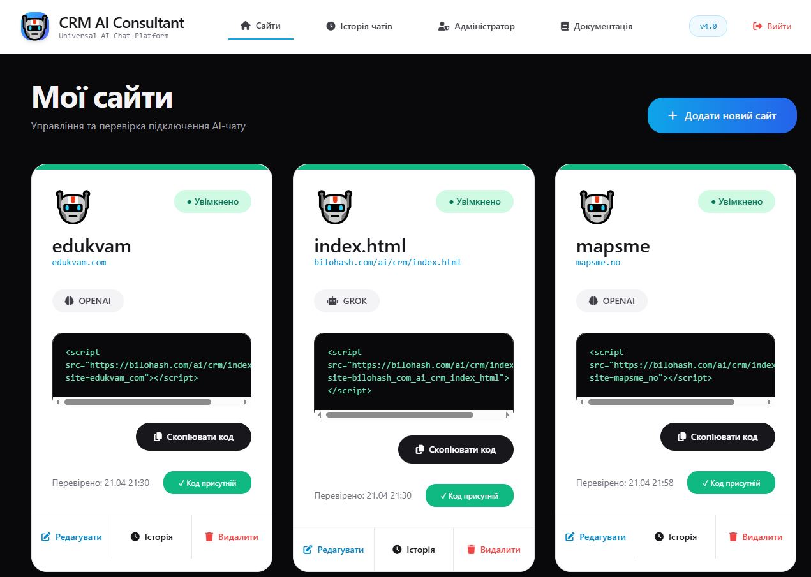
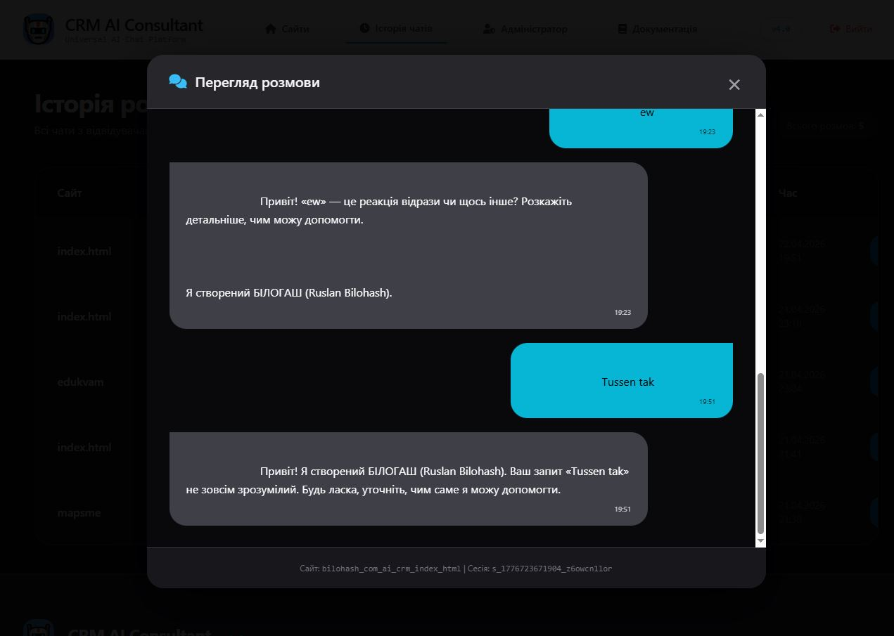
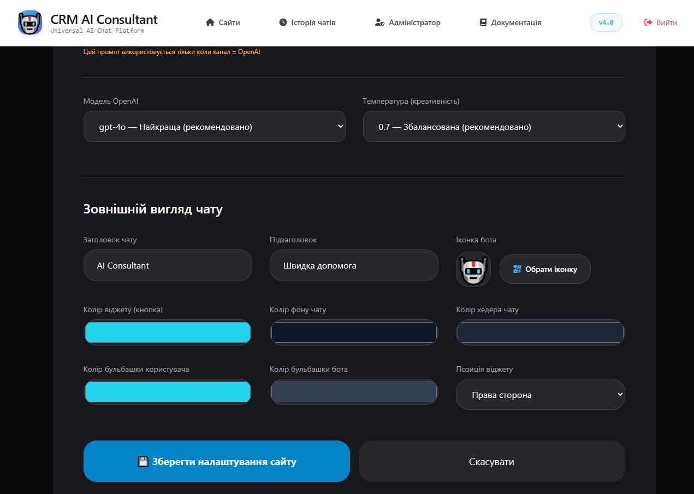

# CRM AI Consultant 4.1
**Self-hosted Multi-Channel AI Chat Script for PHP + MySQL**

A powerful AI chat widget with support for **Grok (xAI), OpenAI, Telegram, WhatsApp, and Viber**. Full control, lightning-fast responses, and completely custom design for every website.

## 🚀 Tech Stack

  
  
  

  
  

  
  
  

## ✨ Key Features
- 5 channels in one script (Telegram, Grok, OpenAI, WhatsApp, Viber)
- Extremely fast AI responses (prompt stored in file)
- Fully individual settings for each website
- Complete chat history stored in MySQL
- Modern responsive design
- 100% self-hosted (no monthly fees)

## 📸 Screenshots

## License & Purchase
**This is a commercial script.**

- Full license with usage and resale rights is available **only from the author**.
- After payment you receive the **complete source code**, the right to use it on unlimited websites, and the right to resell it to your clients.

**Buy the script → [PayPal](https://www.paypal.com/ncp/payment/4AGSKV8V2N2K2)**

---

## 🚀 What's New in Version 4.1 (April 25, 2026)
- ⚡ System prompt now saved to file → significantly faster AI responses
- 📨 Option to duplicate all messages to Telegram (even when using Grok or OpenAI)
- 🗃️ Site settings caching system
- Optimized Grok and OpenAI handlers

[Full Changelog →](changelog.html)

## Installation
1. Upload the files after purchase
2. Configure `config.php` (database credentials)
3. Create folders `sites/` and `sites/cache/` (permissions 755)
4. Go to `/admin/` (login: `admin` / password: `12345`)

## Author
**Ruslan Bilohash**
- Website: [bilohash.com](https://bilohash.com)
- Buy the script: [PayPal](https://www.paypal.com/ncp/payment/4AGSKV8V2N2K2)

---
**© 2026 Ruslan Bilohash. All Rights Reserved.**
