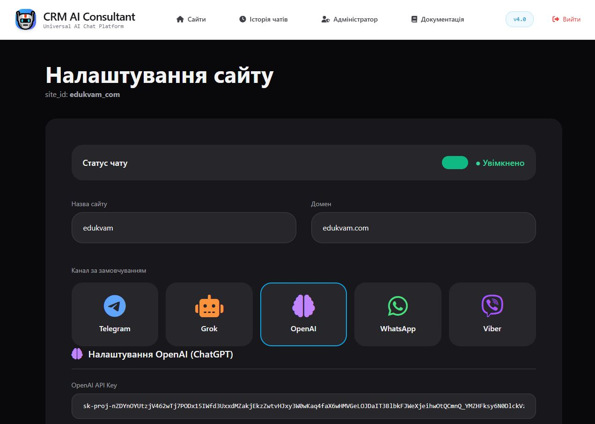
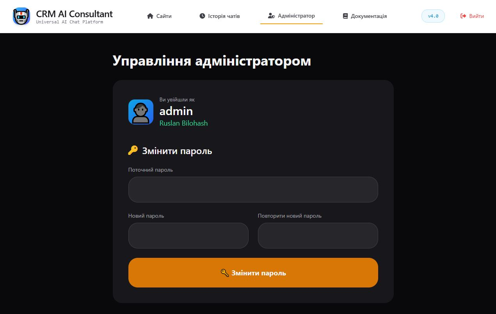

# CRM AI Consultant 4.1

**Самохостинговий мультиканальний AI-чат скрипт на PHP + MySQL**

Потужний AI-віджет з підтримкою **Grok (xAI), OpenAI, Telegram, WhatsApp та Viber**. Повний контроль, індивідуальний дизайн і швидкі відповіді.

## ✨ Основні можливості

- **5 каналів в одному скрипті**: Telegram, Grok, OpenAI (GPT), WhatsApp, Viber
- **Дуже швидкі відповіді** — промпт зберігається у файл
- **Повністю індивідуальні налаштування** для кожного сайту
- **Історія чатів** у MySQL
- **Гарний адаптивний дизайн** віджету
- **Просте встановлення** за 30 секунд
- **100% самохостинг** — без абонплати

## 📸 Скріншоти

### Адмін-панель

### Дизайн чату

### Історія розмов

### Управління адміністратором

## 🚀 Що нового у версії 4.1

- ⚡ Промпт зберігається у файл → **значно швидші відповіді**
- 📨 Можливість дублювати повідомлення в Telegram
- 🗃️ Кешування налаштувань
- 🔧 Оптимізовані обробники Grok та OpenAI

[Переглянути повний Changelog →](changelog.html)

## Встановлення

1. Завантажте файли у папку `/ai/crm/`
2. Створіть базу даних і імпортуйте структуру (якщо потрібно)
3. Налаштуйте `config.php`
4. Створіть папки `sites/` та `sites/cache/` (права 755)
5. Зайдіть в `/admin/` → логін: `admin` / пароль: `12345`

## Ліцензія

Повний вихідний код. Дозволено використовувати та продавати своїм клієнтам.

---

**Автор:** [Ruslan Bilohash](https://bilohash.com)  
**GitHub:** [github.com/Ruslan-Bilohash/crm-ai-consultant](https://github.com/Ruslan-Bilohash/crm-ai-consultant)
