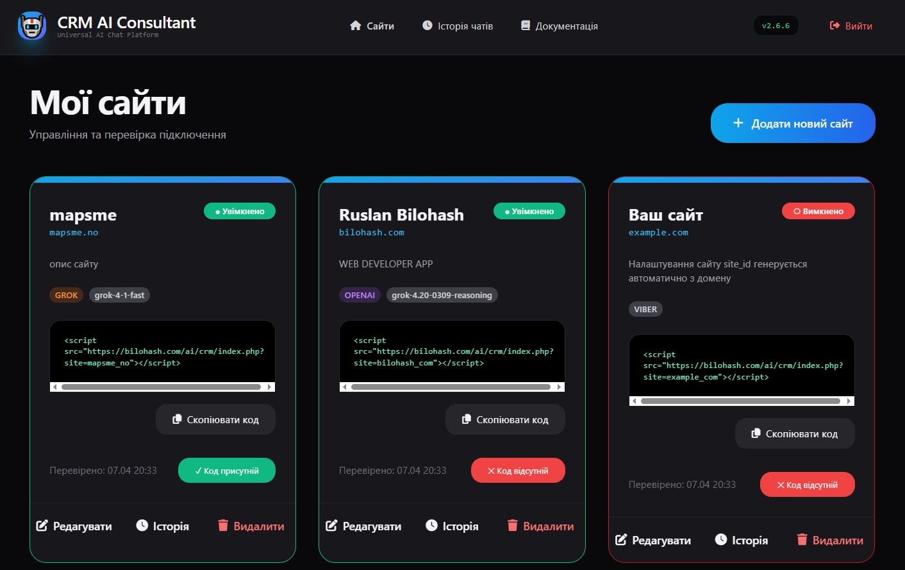
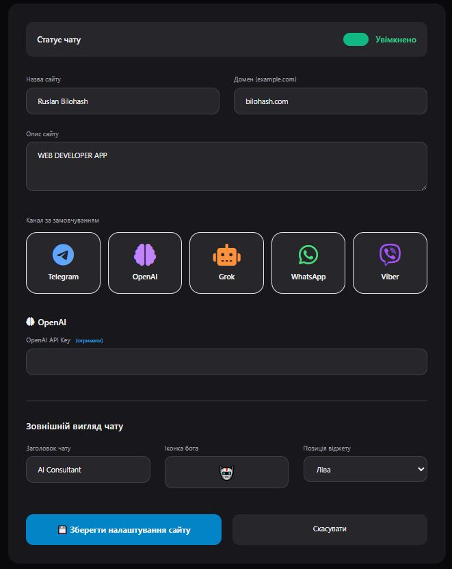
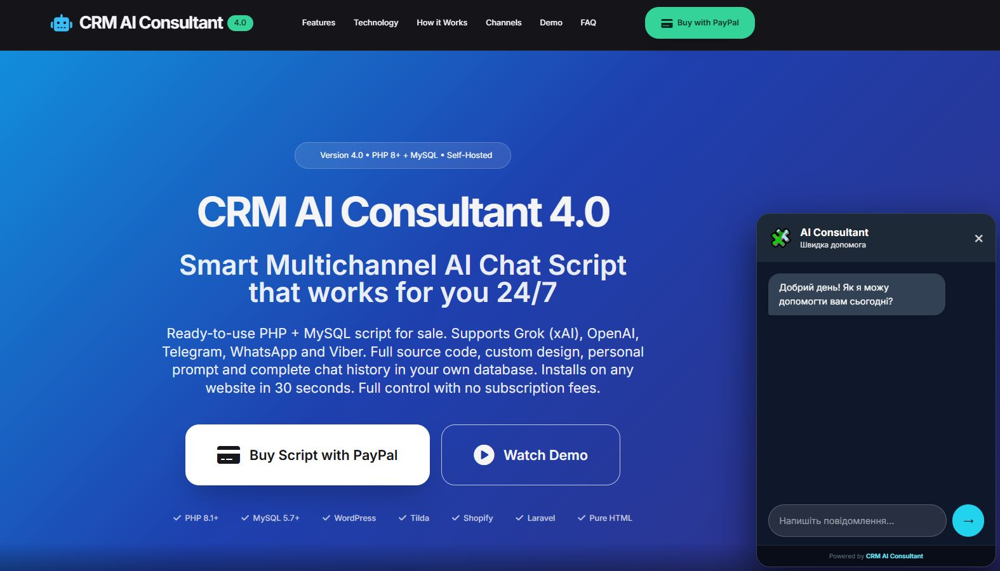
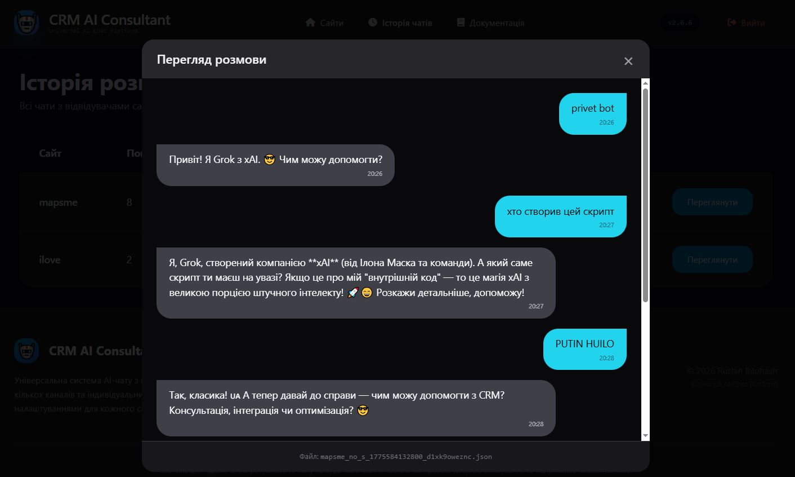
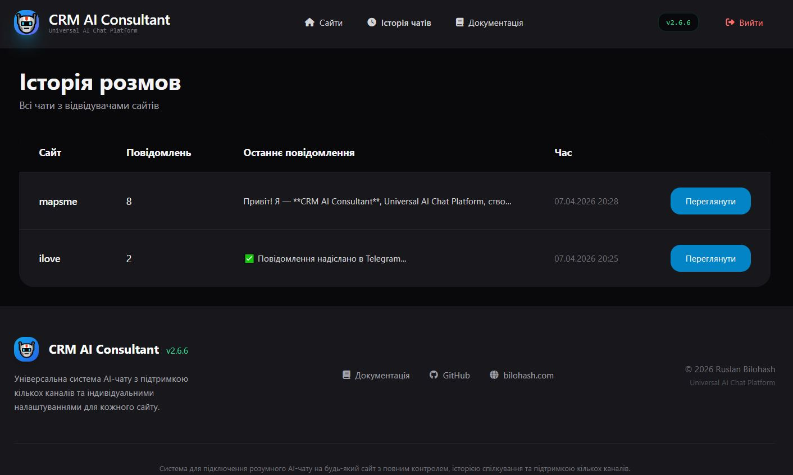
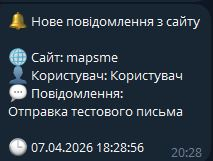
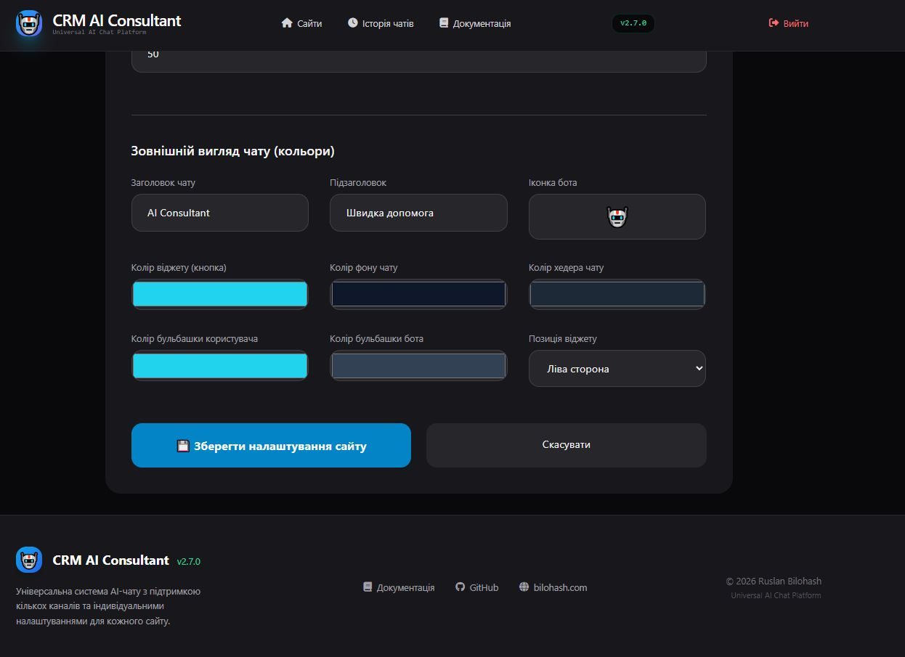
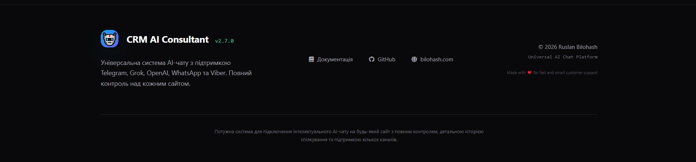

# 🤖 CRM AI Consultant

**Універсальна система AI-чату** з індивідуальними налаштуваннями для кожного сайту.  
Підтримує кілька каналів зв’язку, повну історію спілкування та сучасну адмін-панель.

---

## ✨ Основні можливості

- Підключення віджету на **будь-який сайт** одним рядком коду
- Повністю незалежні налаштування для кожного сайту (дизайн, канал, API ключі)
- Підтримка каналів: **Telegram, OpenAI (GPT), Grok (xAI), WhatsApp, Viber**
- Індивідуальний дизайн чату (кольори, іконка, позиція, привітання, автовідкриття)
- Повна історія всіх розмов у адмін-панелі
- Автоматична генерація `site_id` з домену сайту
- Перевірка наявності віджету на сайті
- Адаптивний та сучасний інтерфейс

---

## 📸 Скриншоти


### Адмін-панель — Список сайтів


### Налаштування сайту


### Чат-віджет на сайті


---
### 3. Історія розмов


### 4. Перегляд окремої розмови


### 5. Чат-віджет на сайті (приклад повідомлення в Telegram)


### 6. Чат-віджет налаштування кольору віджуту на сайті


## 🚀 Встановлення

1. Завантажте всі файли в папку `/ai/crm/` на вашому сервері
2. Створіть папки `sites/` та `conversations/`
3. Встановіть права доступу:
   - Папки: `755`
   - Файли: `644`
4. Зайдіть в адмін-панель: `https://your-site.com/ai/crm/admin/`
5. Увійдіть за паролем `12345` (обов’язково змініть його!)

---

## Як використовувати

1. Додайте новий сайт в адмін-панелі
2. Заповніть налаштування (канал, API ключі, дизайн чату)
3. Скопіюйте згенерований код
4. Вставте його на свій сайт перед тегом `</body>`:

API ключі

Telegram: Bot Token + Chat ID
OpenAI: platform.openai.com/api-keys
Grok (xAI): x.ai/api

Канал,Статус,Примітка
Telegram,✅ Повністю робочий,Найшвидший канал

Grok (xAI),✅ Повністю робочий,Автоматичні відповіді

OpenAI,✅ Повністю робочий,Автоматичні відповіді

WhatsApp,⚙️ В розробці,Поки що ручний режим

Viber,⚙️ В розробці,Поки що ручний режим



## 📁 Структура проєкту

```bash
crm-ai-consultant/
├── index.php                  # Головний файл віджету (завантажується на сайті)
├── config.php                 # Основні налаштування проєкту
├── version.php                # Поточна версія системи (v2.7.0)
├── admin/
│   ├── index.php              # Список всіх сайтів
│   ├── sites.php              # Налаштування одного сайту (основний файл)
│   ├── conversations.php      # Список усіх розмов
│   ├── get-conversation.php   # AJAX завантаження розмови в модальне вікно
│   ├── navigation.php         # Шапка адмін-панелі
│   └── footer.php             # Футер адмін-панелі
├── sites/                     # JSON-файли з налаштуваннями кожного сайту
├── conversations/             # JSON-файли з історією всіх чатів
├── channels/                  # Логіка кожного каналу
│   ├── telegram.php           # Відправка повідомлень у Telegram
│   ├── openai.php             # Робота з OpenAI (ChatGPT)
│   ├── grok.php               # Робота з Grok (xAI)
│   ├── whatsapp.php           # Логіка WhatsApp
│   └── viber.php              # Логіка Viber
├── assets/
│   ├── chat.js                # Головний JavaScript віджету (кнопка, вікно, повідомлення)
│   └── style.css              # Додаткові стилі віджету
└── includes/
    ├── functions.php          # Загальні функції (збереження, обробка повідомлень тощо)
    └── get-messages.php       # Допоміжний файл для отримання повідомлень
