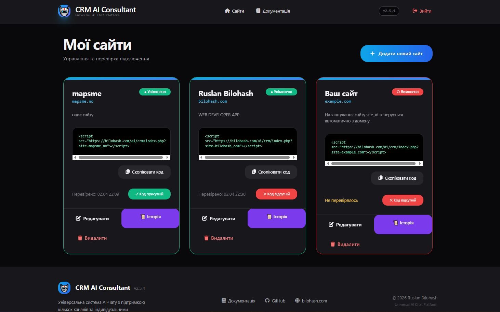
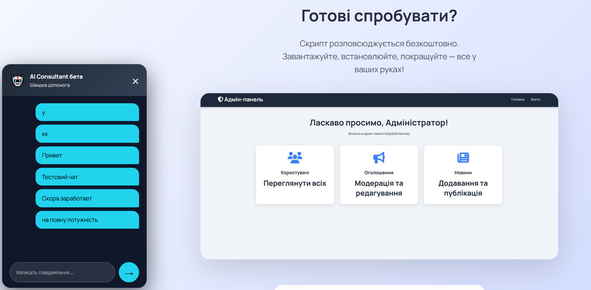

# 🤖 CRM AI Consultant

**Універсальна система AI-чату** з індивідуальними налаштуваннями для кожного сайту.  
Підтримує кілька каналів зв’язку, повну історію спілкування та сучасну адмін-панель.

---

## ✨ Основні можливості

- Підключення віджету на **будь-який сайт** одним рядком коду
- Повністю незалежні налаштування для кожного сайту (дизайн, канал, API ключі)
- Підтримка каналів: **Telegram, OpenAI (GPT), Grok (xAI), WhatsApp, Viber**
- Індивідуальний дизайн чату (кольори, іконка, позиція, привітання, автовідкриття)
- Повна історія всіх розмов у адмін-панелі
- Автоматична генерація `site_id` з домену сайту
- Перевірка наявності віджету на сайті
- Адаптивний та сучасний інтерфейс

---

## 📸 Скриншоти

### Адмін-панель — Список сайтів


### Налаштування сайту


### Чат-віджет на сайті


---

## 🚀 Встановлення

1. Завантажте всі файли в папку `/ai/crm/` на вашому сервері
2. Створіть папки `sites/` та `conversations/`
3. Встановіть права доступу:
   - Папки: `755`
   - Файли: `644`
4. Зайдіть в адмін-панель: `https://your-site.com/ai/crm/admin/`
5. Увійдіть за паролем `12345` (обов’язково змініть його!)

---

## Як використовувати

1. Додайте новий сайт в адмін-панелі
2. Заповніть налаштування (канал, API ключі, дизайн чату)
3. Скопіюйте згенерований код
4. Вставте його на свій сайт перед тегом `</body>`:

Канал,Статус,Примітка
Telegram,✅ Повністю робочий,Найшвидший канал
Grok (xAI),✅ Повністю робочий,Автоматичні відповіді
OpenAI,✅ Повністю робочий,Автоматичні відповіді
WhatsApp,⚙️ В розробці,Поки що ручний режим
Viber,⚙️ В розробці,Поки що ручний режим

```html
<script src="https://bilohash.com/ai/crm/index.php?site=ваш_site_id"></script>

crm-ai-consultant/
├── index.php                 # Головний файл віджету
├── config.php
├── admin/
│   ├── index.php             # Список сайтів
│   ├── sites.php             # Налаштування сайту
│   ├── conversations.php     # Історія чатів
│   ├── navigation.php
│   └── footer.php
├── sites/                    # JSON-файли налаштувань сайтів
├── conversations/            # Історії всіх розмов
├── channels/
│   ├── telegram.php
│   ├── openai.php
│   ├── grok.php
│   ├── whatsapp.php
│   └── viber.php
├── assets/
│   ├── chat.js
│   └── style.css
└── includes/
    ├── functions.php
    └── get-messages.php
